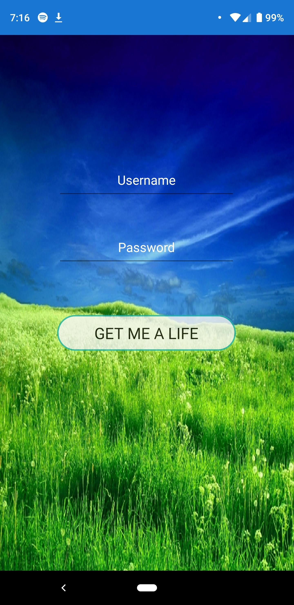
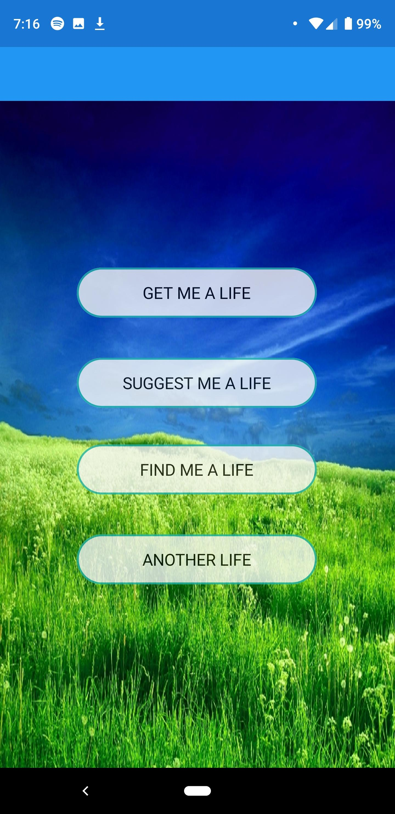
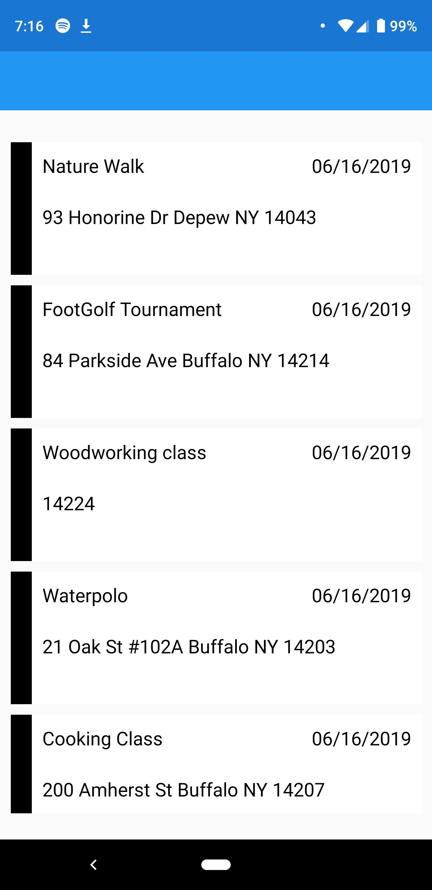
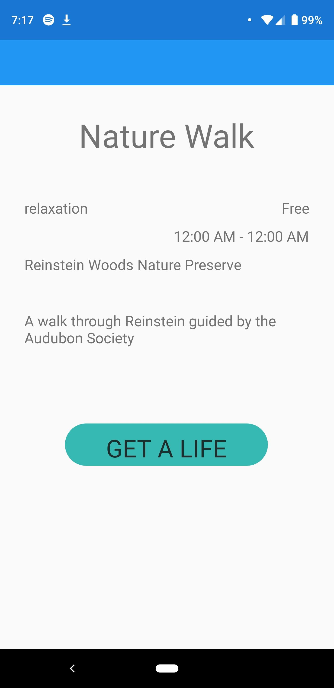

# GetMeALife
## Because you're not meant to live your life alone.

Hello and welcome to our App. We hope you enjoy your new life!

### How to Install/Run:
1. There will be an .apk files uploaded to the github in the APKs folder. 
2. The APK will work on an Android Device of version 8.0 (API Level 26) and up, if for any reason a lower version is required feel free to contact me via Slack. 
3. Download the APK your Android Device, and "run" it from the downloads to install it to your phone, you may be prompted that the APK is unsafe and that Google Play doesn't recognize the developer, simply press install anyway and we promise that it's not malicious ;).

### Logging in:
After you install and open the Get Me A Life, you will be prompted with a Login screen. Feel free to enter any username and password and you will be given access to the app. 
#### Couple notes! 
1. Don't give a real password, the passwords are currently stored literally as we did not get time to polish off an encryption. 
2. You can login using the same username/password to access the same user account, doing so will build your preferences over time. 
3. Logging in with fresh credentials will give you a new user/tutorial experience until you have tracked your first event or you close/reopen the app.

### Now that you can login what is this piece of loveliness called GetMeALife:
1. Get Me A Life is based around not only the prompt given at the start of the hackathon, but the idea of pulling users out to events near them by giving them multiple choices related to their preferences. 
2. On first use, a user would simply get nearby events, and would choose the events that they want to go to by confirming them in the app.
3. As the user confirms more and more, their "preference" profile would be built up - and there would be a separate option for that user to search based more on their preferences, this would be the "Suggest Me A Life" option. 
4. The Another Life option is based around the idea that the user might want to go against their preferences - so that option would look at events not within user preferences.
5. There were plans for a decision tree based option, where users would select various options like "Active/Spectator" or "Group/Solo" or "Family Oriented/Non Family Oriented", and events would be filtered out until there was a curated list. However, we were unable to implement that at this time.

### What did we use?

1. All of our code is in C#! 
2. Our Android App is built using Xamarin Forms which builds off of .Net Standard 2.0. 
3. Our Api is built in ASP.NET Core 2.2 and is hosted on an Azure App Service found here http://getmealife.azurewebsites.net/. 
4. If you'd like you can go to http://getmealife.azurewebsites.net/ui/playground to send GraphQL to our API directly. 
5. The playground also contains the Schema and documentation for our models. 
6. Our Class library where we store all of our models,interfaces, and access to data sources is a .Net Standard 2.0 Class Library. 
7. As for Graph QL we used the Graph QL .Nuget Package to help parse and filter GraphQL queries. 
8. Lastly we included random and typed events from BoredApi when you attempt to query for events in our Api.

### Screenshots: 

